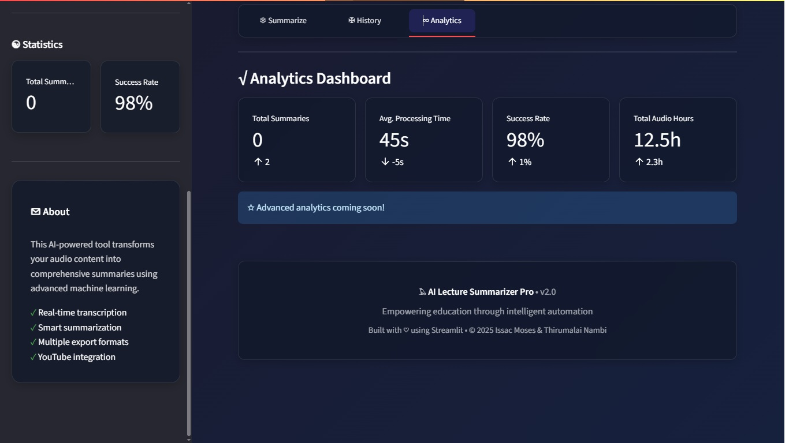

# 𓅃 AI Lecture Summarizer Pro

> 🚀 Transform your **lecture audio/video/YouTube** content into intelligent, exportable summaries using advanced AI.
- [AI Lecture Summarizer Banner](https://github.com/Issac-Moses/Notes-Summarizer)
- 
---
## 🖥️ Demo Screenshot




---
## 📌 Project Overview

**AI Lecture Summarizer Pro** is a modern Streamlit-based application that:
- Accepts audio via microphone, file upload, or YouTube link.
- Transcribes using [OpenAI Whisper](https://github.com/openai/whisper).
- Summarizes using `google/flan-t5-large` via HuggingFace Transformers.
- Exports content in **PDF**, **Word**, or **JSON** formats.
- Uses advanced CSS for sleek UI and real-time interaction.
- Developed by **Issac Moses & Thirumalai Nambi**.

---

## 🌟 Features

- 🎤 Real-time microphone recording.
- 📁 Upload audio/video files (`.mp3`, `.mp4`, `.wav`, etc.).
- ▶️ Summarize YouTube videos directly via URL.
- 🧠 AI-based summarization and key point extraction.
- 📄 Export to PDF, Word, or JSON.
- 📊 History & analytics tabs with session tracking.
- 🌈 Stylish dark theme with animations and custom components.
- 🤖 Powered by: `Whisper`, `Flan-T5`, `Streamlit`, `FPDF`, `python-docx`, `yt-dlp`.

---


## 🧰 Tech Stack

| Component         | Technology                         |
|------------------|-------------------------------------|
| Frontend         | Streamlit + Custom CSS              |
| Transcription    | OpenAI Whisper                      |
| Summarization    | HuggingFace Transformers (Flan-T5)  |
| Audio Recording  | sounddevice + scipy                 |
| File Export      | fpdf, python-docx, json             |
| YouTube Support  | yt-dlp                              |

---

## 🗂️ Project Structure

- ├── main.py # Streamlit frontend
- ├── lecture4.py # Backend logic (AI, transcription, exports)
- ├── style.css # Custom styles and UI enhancements
- ├── silvy_logo.png # App logo (optional)
- └── README.md # This file

---
## 🔧 Installation

1. **Clone the repo**  
    ```bash
    git clone https://github.com/Issac-Moses/Notes-Summarizer
    cd Notes-Summarizer-AI
2. **Install dependencies**
   Make sure Python 3.9+ is installed.
    ```bash
    pip install -r requirements.txt
3. Run the App
   ```bash
   streamlit run main.py
---
## ⚙️ Usage Guide
1. Choose input: 🎙 Microphone | 📂 File | ▶️ YouTube.

2. Configure summary quality and length.

3. Click Start/Process.

4. View results under the Summary tab.

5. Download as PDF / DOCX / JSON.
---
## 🙌 Acknowledgements

1. [OpenAI Whisper](https://github.com/openai/whisper)

2. [HuggingFace Transformers](https://huggingface.co/transformers/)

3. [Streamlit](https://streamlit.io/)

4. [yt-dlp](https://github.com/yt-dlp/yt-dlp)
---
## 📜 License
- MIT License © 2025 [Issac Moses](https://github.com/Issac-Moses)
---
## 📬 Contact
- 📧 Issac Moses – issacmoses19082005@gmail.com
- 💼 [LinkedIn](https://www.linkedin.com/in/i%EF%BD%93%EF%BD%93-a-c-m-%E5%8F%A3%EF%BD%93%E3%83%A2%EF%BD%93-d-12837831b/)
- 📧 Thirumalainambi – sthirumalainambi5802@gmail.com 
- 💼 [LinkedIn](www.linkedin.com/in/thirumalai-nambi-s-a94b7a29b)
---
